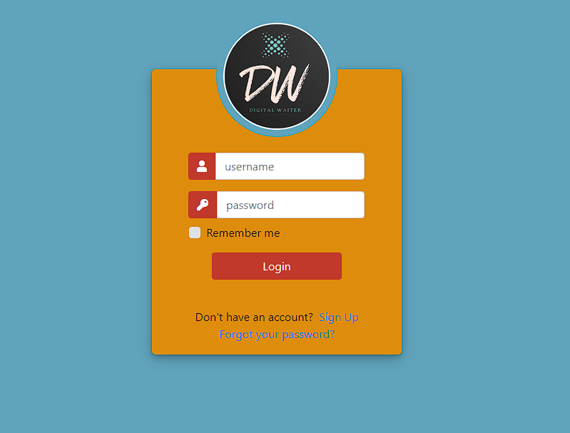
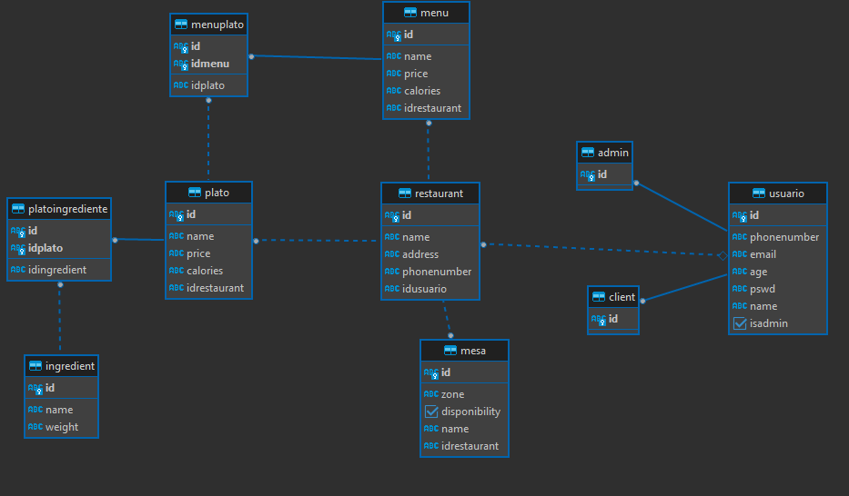

# ARSW-Digital_Waiter
## Escuela Colombiana de Ingeniería
### Arquitecturas de Software

Integrantes
```
Juan Esteban Cortés
Andrés Felipe Martínez
David Ricardo Otálora 
```


## Construción de proyecto

# DIGITAL WAITER


### Tecnologias usadas en el proyecto


# Frontend de Digital Waiter

Para el frontend utilizamos css3 y html5 para poder brindar una experiencia de UX
amable y visualmente entendible para el cliente final


# Backend de Digital Waiter

>Diagrama de base de datos

