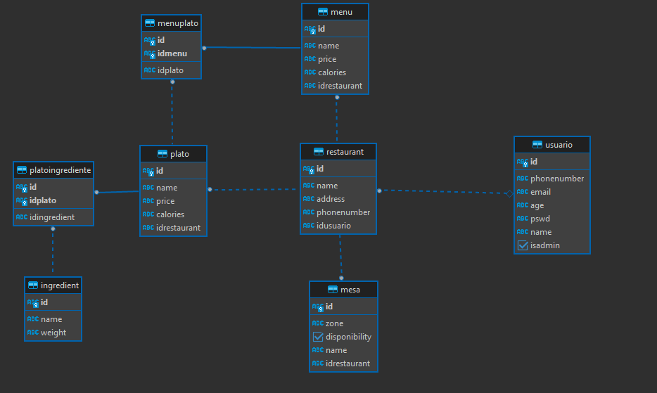

# ARSW-Digital_Waiter
## Escuela Colombiana de Ingeniería
<<<<<<< HEAD
### Arquiecturas de Software
=======
### Arquitecturas de Software
>>>>>>> f34250d47ca38fc5f9955cb926b3707f3745f1c0

Integrantes
```
Juan Esteban Cortés
Andrés Felipe Martínez
<<<<<<< HEAD
David Ricardo Otalora 
```


## Construción de proyecto 

#DIGITAL WAITER

 
###Tecnologias usadas en el proyecto
=======
David Ricardo Otálora 
```


## Construción de proyecto

# DIGITAL WAITER


### Tecnologias usadas en el proyecto
>>>>>>> f34250d47ca38fc5f9955cb926b3707f3745f1c0


<<<<<<< HEAD
#Frontend de Digital Waiter

Para el frontend utilizamos css3 y html5 para poder brindar una experiencia de UX 
amable y visualmente entendible para el cliente final 
=======
# Frontend de Digital Waiter

Para el frontend utilizamos css3 y html5 para poder brindar una experiencia de UX
amable y visualmente entendible para el cliente final
>>>>>>> f34250d47ca38fc5f9955cb926b3707f3745f1c0


<<<<<<< HEAD
#Backend de Digital Waiter

>Diagrama de base de datos 
=======
# Backend de Digital Waiter

>Diagrama de base de datos
>>>>>>> f34250d47ca38fc5f9955cb926b3707f3745f1c0

